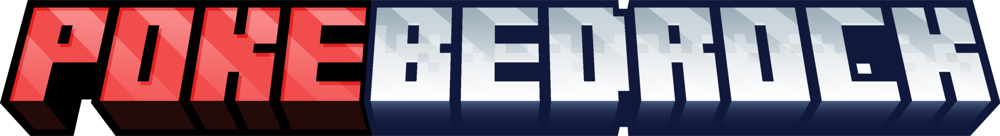

# 🌟 **PokéBedrock – Media Kit** 🌟

Welcome to the official media kit for **PokéBedrock** 🎮, a **Minecraft Bedrock Edition** add-on that brings the world of **Pokémon** to life with immersive features, original assets, and seamless gameplay integration. 🕹️

This kit includes branding assets and visual guidelines to help contributors, press, and content creators use **PokéBedrock** assets correctly and consistently. 🚀

---

## 🔥 **Brand Guidelines** 🔥

These guidelines define the visual identity of the project logo and provide instructions on how to use it consistently across all platforms. 📐

---

## 1️⃣ **Logo Usage** 🖼️

### **Primary Logo**
The primary logo is shown below and should be used in its original form without alterations to color, aspect ratio, or elements.

 🎨

### **Clear Space** 💡
- Maintain a **minimum clear space** around the logo equal to the **height of the logo** itself.
- Do not allow text or other graphics to crowd this space. 🧹

### **Minimum Size** 🧐
- **Digital:** 64px height minimum
- **Print:** 20mm height minimum

### **Incorrect Usage** 🚫
Do **not**:
- Recolor the logo 🎨
- Add shadows or effects ✨
- Rotate or distort the logo 🔄
- Place on similarly colored backgrounds without contrast 🎭

---

## 2️⃣ **Color Palette** 🎨

These colors were extracted from the logo and define the visual identity:

| **Color Name**      | **RGB**             | **Hex**   |
|---------------------|---------------------|-----------|
| Light Gray          | (233, 231, 231)     | `#E9E7E7` |
| Pale Gray-Brown     | (193, 188, 187)     | `#C1BCBB` |
| Medium Gray         | (154, 150, 149)     | `#9A9695` |
| Dark Gray           | (107, 103, 102)     | `#6B6766` |
| Charcoal            | (58, 55, 54)        | `#3A3736` |

### Usage 🎨
- **Primary Text/Logo:** Charcoal 🖤
- **Background:** Light Gray 🌫️
- **Accent/Borders:** Medium and Dark Grays 💎

---

## 3️⃣ **Typography** 🔤

The logo image didn’t include a clearly distinguishable typography, but here are some **recommended font pairings** to keep things consistent:

- **Headers:** Inter, Montserrat, or Poppins (bold, modern sans-serifs) 🔠
- **Body Text:** Open Sans or Roboto (clean, readable sans-serifs) 📚

---

## 4️⃣ **Assets Included** 📦

Here are the **PokéBedrock assets** you’ll need for your branding efforts:

- 🖼️ **`logo.png`** – High-resolution logo (Last year’s design)
- 🌟 **`logo_colored.svg`** – Scalable vector logo (Last year’s design)

---

## 5️⃣ **File Formats** 💾

The following file formats are available in your media kit:

- **`logo.png`** (high-res raster image)
- **`logo_colored.svg`** (scalable vector logo)

---

## 6️⃣ **Contact** 📧

Need custom formats or have a press inquiry? Feel free to reach out:

- **GitHub Issues:** [Open an issue](https://github.com/PokeBedrock/media-kit/issues) 🐞
- **Maintainer:** [PokéBedrock] – contact@pokebedrock.com 📩

---

> Please respect the **brand integrity** of **PokéBedrock**. These assets are provided for **community use** and **promotional efforts**. 🙌

---

## Logo Usage Guidelines 📝

- **Do not** edit, recolor, or distort the logo 🔒
- Ensure legibility by maintaining adequate contrast with backgrounds 💡
- Maintain clear space around the logo equal to its height 🎯
